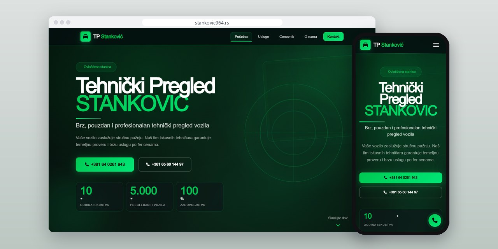
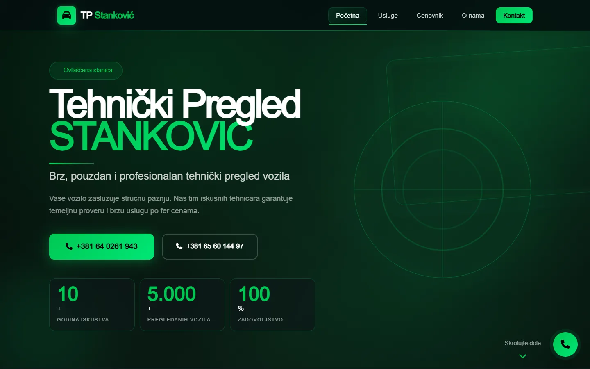
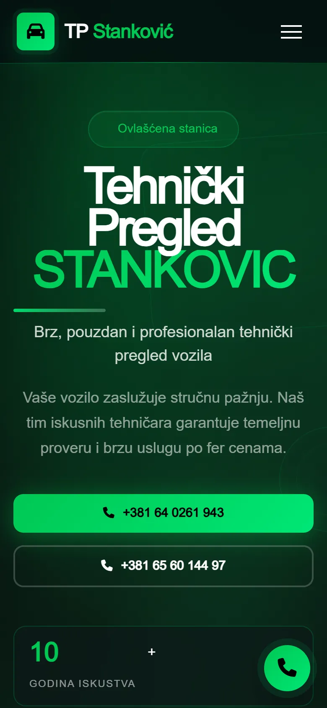
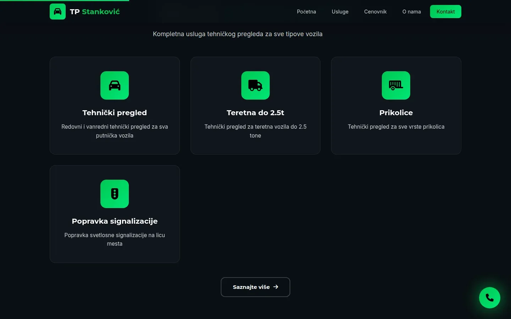
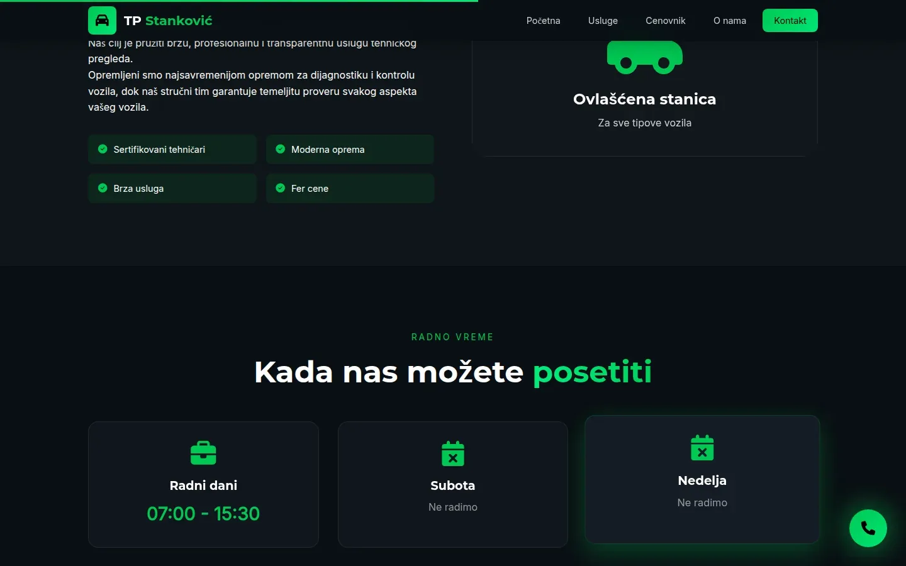

# Tehnički Pregled Stanković 964

Sajt od pet strana za stanicu tehničkog pregleda kod Aleksinca, napravljen za brz poziv iz kola, i privatna PWA za inventar sa sinhronizacijom uživo.

**[stankovic964.rs](https://stankovic964.rs/)** · [Studija slučaja](https://svilenkovic.rs/radovi/tehnicki-pregled-stankovic) · [Stranica aplikacije](https://svilenkovic.rs/aplikacija-tehnicki-pregled) · [English](README.md)

> [!NOTE]
> Klijentski projekat. Izvorni kod pripada klijentu i čuva se u privatnom repozitorijumu. Ova stranica opisuje šta sam uradio i kako.

<table>
  <tr><td><b>Klijent</b></td><td>Tehnički Pregled Stanković 964</td></tr>
  <tr><td><b>Delatnost</b></td><td>Ovlašćena stanica za tehnički pregled vozila</td></tr>
  <tr><td><b>Lokacija</b></td><td>Pertate, Aleksinac</td></tr>
  <tr><td><b>Vrsta</b></td><td>Sajt sa više strana i PWA za inventar</td></tr>
  <tr><td><b>Moj deo posla</b></td><td>Dizajn, izrada, SEO, hosting i održavanje</td></tr>
  <tr><td><b>Tehnologije</b></td><td>PHP 8.3, nginx cache, MariaDB, PWA, Server-Sent Events</td></tr>
</table>

## O projektu

Tehnički Pregled Stanković 964 u Pertatama kod Aleksinca radi putnička vozila, laka teretna do 2,5 t i prikolice, a svetla popravlja na licu mesta. Ne zakazuje se, dolazi se u radno vreme, pa prvi ekran odgovara na ono što bi se inače pitalo telefonom i nudi dva broja za poziv jednim dodirom.

Prva provera posle puštanja u rad pokazala je da strana jako skače dok se učitava (pomeranje sadržaja preko 1), a smirila se tek posle tri odvojene ispravke. Glavni CSS je bio odložen, pa se strana prvo crtala bez stilova i onda prelamala. Brojači na naslovnoj su rasli od nule i menjali širinu, a rezervni font je imao druge proporcije od pravog. Sada se CSS učitava normalno, brojke su statične, a rezervni font ima mere koje odgovaraju pravom.

## Šta sam uradio

- Cenovnik koji nabraja usluge i šta pregled obuhvata bez ispisanih iznosa, jer se važeći cenovnik menja
- Mapa na kontaktu koja je prikazivala drugu firmu iz drugog grada, zamenjena upitom sa adresom, poštanskim brojem i opštinom stanice
- Ponovo uključen keš u nginx-u, pošto je staro pravilo svakom CSS, JS i PHP odgovoru dodavalo zabranu keširanja i poklapalo se pre bloka za PHP
- Devet CSS fajlova spojeno u jedan i mali main.js sa IntersectionObserver-om umesto biblioteke
- Privatna PWA za inventar (artikli, kategorije, količine, cene i istorija izmena), sinhronizovana uživo preko SSE-a, uz povremenu proveru kao rezervu
- Prijava u panel sa bcrypt-om, CSRF tokenima, zaključavanjem na pola sata posle pet promašaja brojanih po korisniku i po adresi, vremenskim ograničenjima sesije i dnevnikom uređaja

## Merenja

| | Performanse | Pristupačnost | Dobre prakse | SEO |
| :-- | :-: | :-: | :-: | :-: |
| Telefon | 88 | 100 | 100 | 100 |
| Desktop | 99 | 100 | 100 | 100 |

PageSpeed Insights, laboratorijsko merenje živog sajta, septembar 2026. Sigurnosna zaglavlja: 6 od 6. HTML validator: bez grešaka. axe provera pristupačnosti: bez prekršaja. Strukturisani podaci: `AutomotiveBusiness`.

## Snimci ekrana

<table>
  <tr>
    <td width="68%" valign="top"></td>
    <td width="32%" valign="top"></td>
  </tr>
</table>

Četiri vrste pregleda u sekciji "Sve na jednom mestu"

O stanici i radno vreme po danima

---

Izrada: [D. Svilenković](https://svilenkovic.rs).
